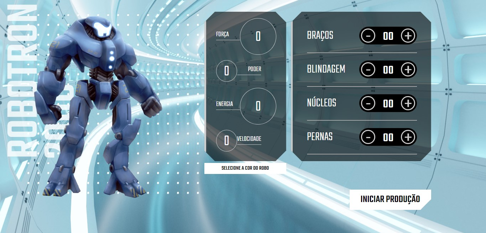

<h1 align="center"> Robotron-2000 </h1>

Robotron-2000 foi um projeto criado pela alura no curso de front-end "Manipulando o DOM" para ensinar métodos de manipular o Document Object Model do HTML.  

  <a href="#-tecnologias">Tecnologias</a>&nbsp;&nbsp;&nbsp;|&nbsp;&nbsp;&nbsp;
  <a href="#-projeto">Projeto</a>&nbsp;&nbsp;&nbsp;|&nbsp;&nbsp;&nbsp;
  <a href="#-layout">Layout</a>

 

  

## 🚀 Tecnologias

Esse projeto foi desenvolvido com as seguintes tecnologias:

- HTML e CSS
- JavaScript
- Git e Github

## 💻 Projeto

O Robotron-2000 é a simulação de uma tela de jogo onde o usuário pode alterar a cor do personagem e adcionar peças aumentando suas skills dinamicamente.

- [Visite o projeto online](https://robotron-2000-iota-rose.vercel.app/)

## 🔖 Layout

Para facilitar o aprendizado a alura disponibilizou um projeto base que pode ser acessado [clicando aqui](https://github.com/pedromarins/robotron-2000)